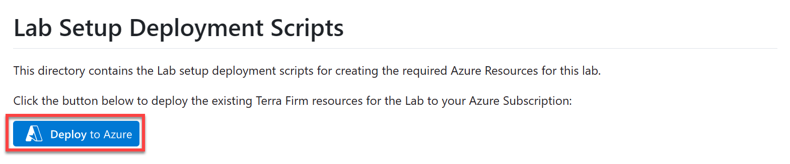
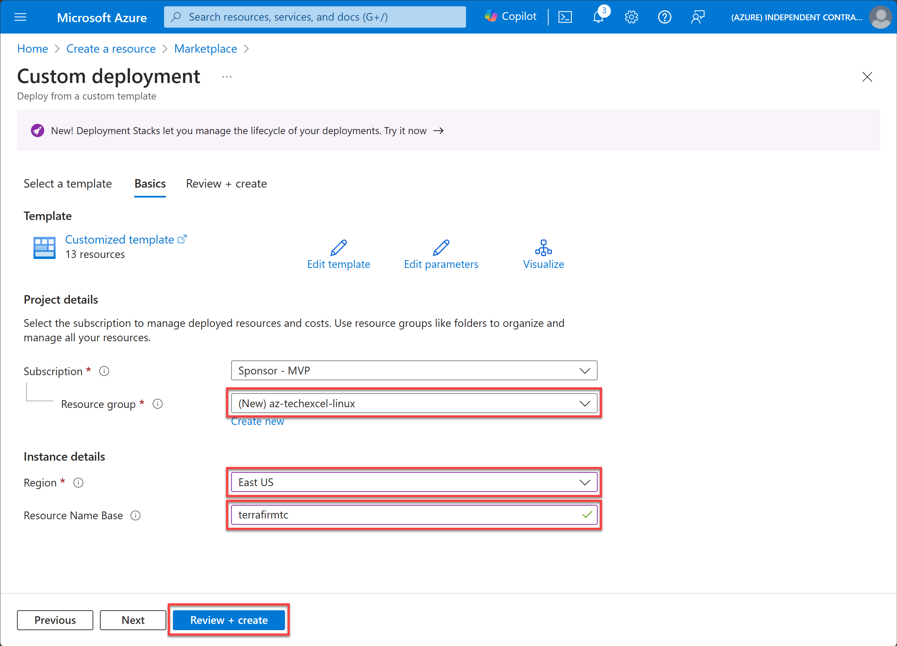

# Task 01 - Create existing resources

## Description

In this task, you will leverage a custom Azure Resource Manager (ARM) template to deploy the existing Azure resources and a simulated on-premises environment for Terra Firm Laboratories.

## Success Criteria

* You have deployed all necessary services.

## Solution

Expand this section to view the solution

1. Sign in to the [Azure Portal](https://portal.azure.com).

1. Open another browser tab, and navigate to the ARM template: [ARM Template on GitHub](https://github.com/microsoft/Microsoft-TechExcel-Migrate-Linux-Workloads/tree/main/resources/deployment).

1. Select **Deploy to Azure**. This will open a new browser tab to the Azure Portal for custom deployments.

    

1. If prompted, sign in with an account that is an owner of the Azure Subscription.

1. Fill in the required ARM template parameters.
    1. Create a new **Resource group**.
    1. Select a **Region**
    1. Specify a **Resource Name Base** (specify a base value that includes your initials to keep unique to prevent naming conflicts, for example, `terrafirmtc`).
    1. Specify a **User Defined Password** (this will be a password that you will use to log into the provisioned VM - replace the suggested password with your own).
    1. Select **Review + create**

    

1. Agree to the Terms and conditions and select **Create**.

    The deployment is now underway. On average, this process can take 30 minutes to complete. It is important that you monitor the deployment progress to ensure there are no problems. You can monitor progress by selecting the notification bell in the upper right corner and selecting **Deployment in progress...**

    >**Note**: While automation can make things simpler and repeatable, sometimes it can fail. If at any time during the ARM template deployment there is a failure, review the failure, delete the Resource Group, and try the ARM template again. Review the failures and adjust for errors as appropriate.

    Once the ARM template is deployed, the status will change to complete.

   **Note**: Verify deployment success of each resource.  Transient errors are possible and can cause problems later in the hands on lab.

