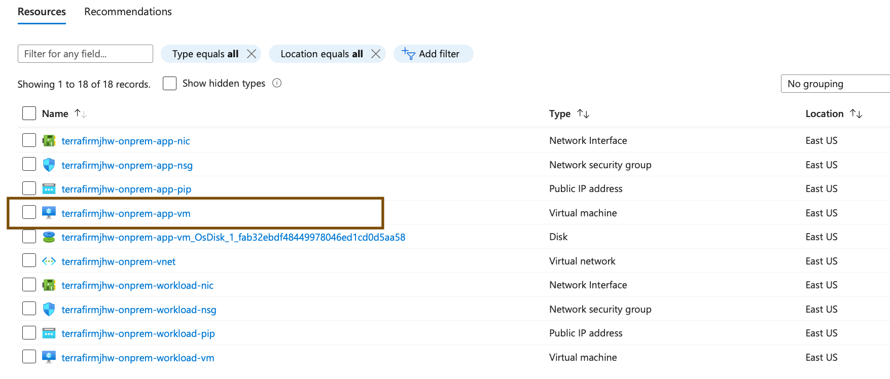
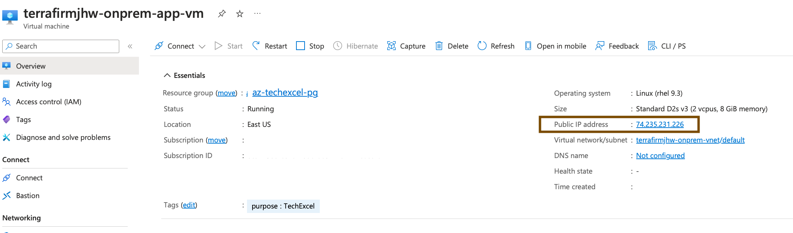
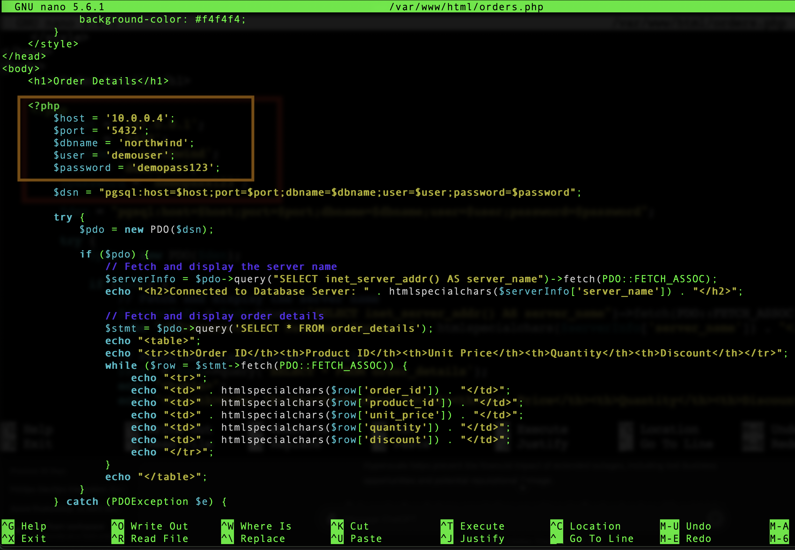

# Task 02 - Validate on-premises web application

## Description

In this task, you will configure the web application hosted on the simulated on-premises APP virtual machine that was provisioned by the ARM Template deployment.

## Success Criteria

* Web Application is configured for secure connection to the database server over the internal network.

## Solution

<details markdown="block">
<summary>Expand this section to view the solution</summary>

1. In the **Azure Portal**, navigate to the **Resource Group** that you created for this lab, then select the **On-premises Workload VM** named similar to `terrafirm-onprem-workload-vm`.

    

1. On the **Virtual Machine** blade, locate and copy the **Private IP Address** for the VM.

    

1. You will need this IP address to configure the web application to use the database workload server

1. In the **Azure Portal**, navigate to the **Resource Group** that you created for this lab, then select the **On-premises APP VM** named similar to `terrafirm-onprem-app-vm`.

    

1. On the **Virtual Machine** blade, locate and copy the **Public IP Address** for the VM.

    

At the top of the Azure Portal, select the **Cloud Shell** icon to open up the Azure Cloud Shell.


1. Within the **Cloud Shell**, enter the following `ssh` command to connect to the VM using SSH. Be sure to replace the `<ip-address>` placeholder with the **Public IP Address** that was just copied for the VM.

    ```bash
    ssh demouser@<ip-address>
    ```

1. When prompted, enter `y` and press Enter to access the certificate warning for this VM. Then continue by entering the **Password** for the VM.

    

    > **Note**: Enter the password you chose when provisioning the VM in the setup lab.

1. Once connected to the VM via SSH, run the following command to install the git utility on the server

    ``` bash
    sudo yum install git  -y
    ```

This will install the git utility.

1. You will now clone the remote git repository holding a script which will configure the web app on the application server. Run the following command:

    ``` bash
    sudo git clone https://github.com/microsoft/TechExcel-Migrate-Linux-workloads.git
    ```

1. You can now run the configuration script by using the following command:

    ``` bash
    sudo bash TechExcel-Migrate-Linux-workloads/resources/deployment/onprem/APP-workload-install.sh
    ```

You will get a status message of `The script was successful`

1. Execute the following command to open the `orders.php` file for the web application in a text editor. The application needs to be configured to connect to the **Azure Database for PostgreSQL Flexible Server** database that was previously migrated.

    ```bash
    sudo nano /var/www/html/orders.php
    ```

    

1. Within the `orders.php` file, set the following values for the **database connection details** section to configure it for the on-premises PostgreSQL Server.

    1. **host**: Enter the **Private IP Address** for the **terrafirm-onprem-workload-vm** instance that was  copied in step 2.
    1. Note: The IP address may already be 10.0.0.4 in which case, press `^X` (ctrl-X) to exit the editor.

1. If you did need to change the **host** entry then to save the file, press `^X` (ctrl-X) to exit the editor, press `Y` to save the modified buffer, then press **Enter** to write the changes to the file.

You have now learnt some basic Linux commands and configured the web application to use the database on an internal network rather than across the internet.

</details>
