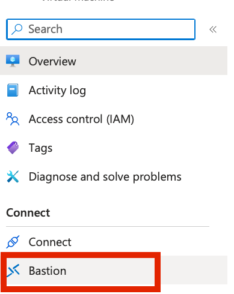
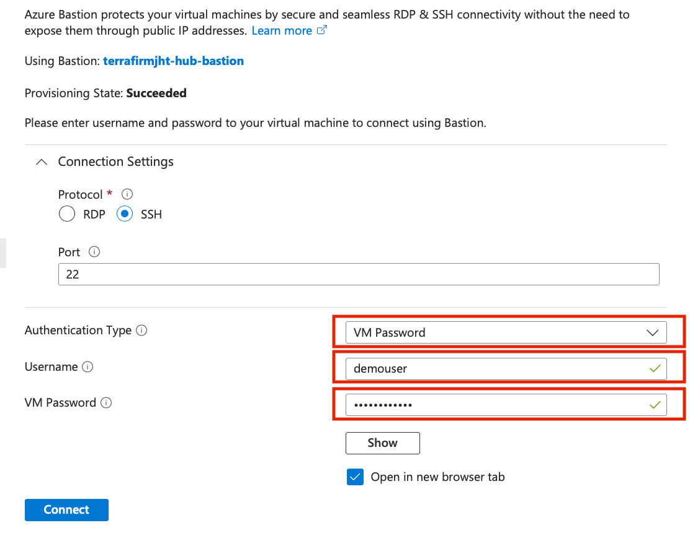
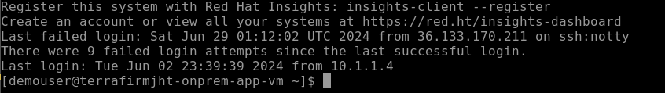
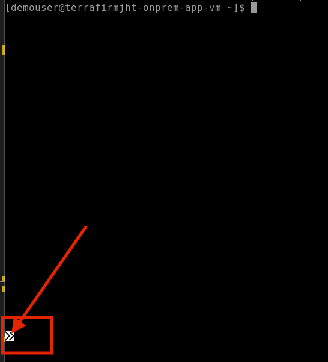
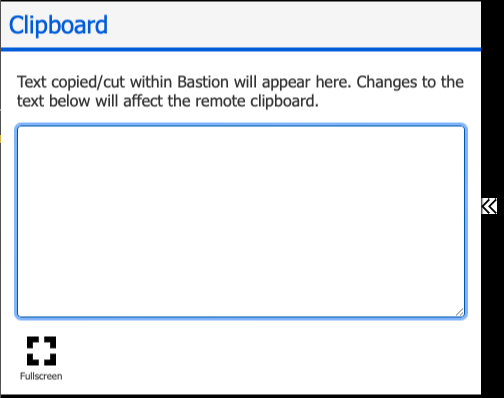
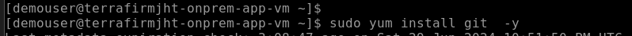

# Task 02 - Configure on-premises web application

## Description

In this task, you will configure the web application hosted on the simulated on-premises APP virtual machine that was provisioned by the ARM Template deployment.

## Success Criteria

* Web Application is configured for secure connection to the database server over the internal network.

## Solution

<details markdown="block">
<summary>Expand this section to view the solution</summary>

1. In the **Azure Portal**, navigate to the **Resource Group** that you created for this lab, then select the **On-premises Workload VM** named similar to `terrafirm-onprem-workload-vm`.

    

1. On the **Virtual Machine** blade, locate and copy the **Private IP Address** for the VM.

    

1. You will need this IP address to configure the web application to use the database workload server

1. In the **Azure Portal**, navigate to the **Resource Group** that you created for this lab, then select the **On-premises APP VM** named similar to `terrafirm-onprem-app-vm`.

    

1. On the **Virtual Machine** blade, either use the Search function in the left hand menu or click on Bastion. We will use a bastion host as the method to connect to our VMs as this is a more secure method.

    

    

1. Within the **Bastion** page, enter the following:
    1. **Authentication Type**    VM Password
    1. **Username**               demouser
    1. **VM Password**            <`the secure password you created when you created the VMs in Task01`>

     

    >**Note**: You may need to allow popups if they are blocked in your browser.

1. When connectioned to the VM via the Bastion host you will get a screen like this:

    

1. Once connected via Bastion, run the following command to install the git utility on the server by using the clipboard within the session:

    

1. Click the arrows which will expand the window

     

1. Copy the command below and paste into the clipboard.

    ``` bash
    sudo yum install git  -y
    ```

    

1. Now click back into the original window which will paste the command and run it

    

This will install the git utility.

1. You will now clone the remote git repository holding a script which will configure the web app on the application server. Run the following command:

    ``` bash
    sudo git clone https://github.com/microsoft/TechExcel-Migrate-Linux-workloads.git
    ```

1. You can now run the configuration script by using the following command:

    ``` bash
    sudo bash TechExcel-Migrate-Linux-workloads/resources/deployment/onprem/APP-workload-install.sh
    ```

You will get a status message of `The script was successful`

1. Execute the following command to open the `orders.php` file for the web application in a text editor. The application needs to be configured to connect to the **Azure Database for PostgreSQL Flexible Server** database that was previously migrated.

    ```bash
    sudo nano /var/www/html/orders.php
    ```

    

1. Within the `orders.php` file, set the following values for the **database connection details** section to configure it for the on-premises PostgreSQL Server.

    1. **host**: Enter the **Private IP Address** for the **terrafirm-onprem-workload-vm** instance that was  copied in step 2.
    1. Note: The IP address may already be 10.0.0.4 in which case, press `^X` (ctrl-X) to exit the editor.

1. If you did need to change the **host** entry then to save the file, press `^X` (ctrl-X) to exit the editor, press `Y` to save the modified buffer, then press **Enter** to write the changes to the file.

You have now learnt some basic Linux commands and configured the web application to use the database on an internal network rather than across the internet.

</details>
