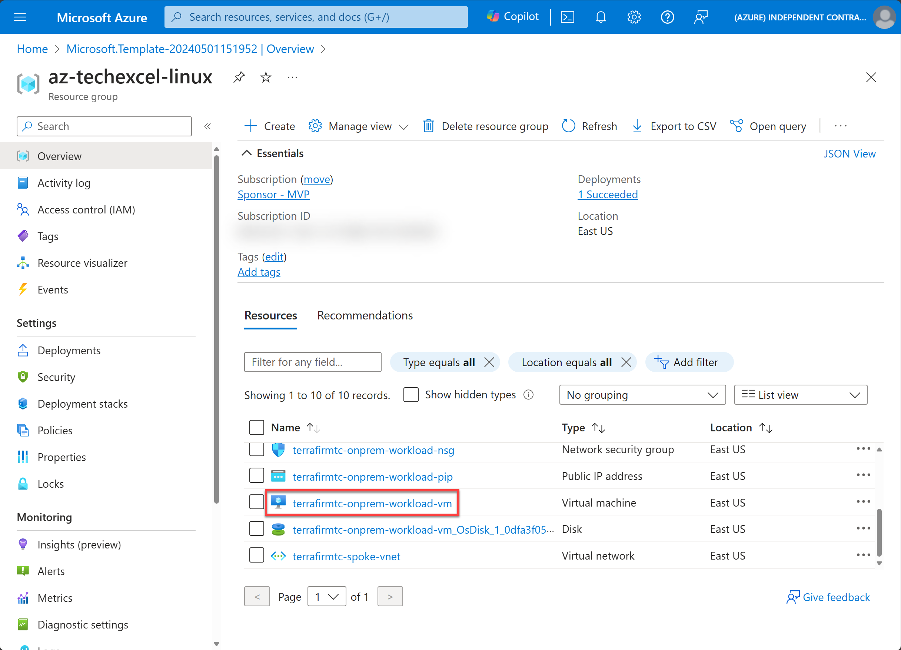
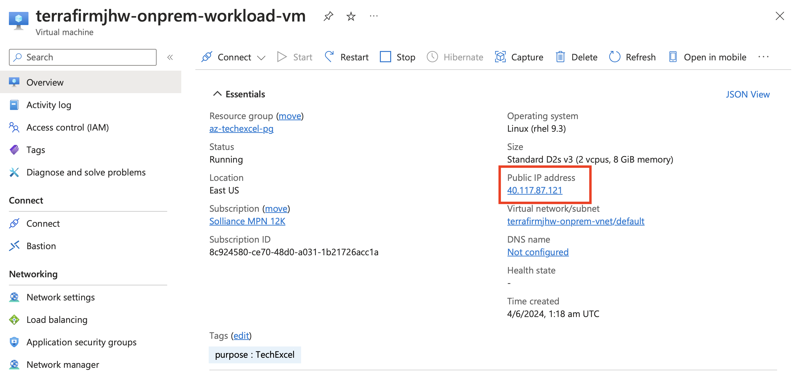
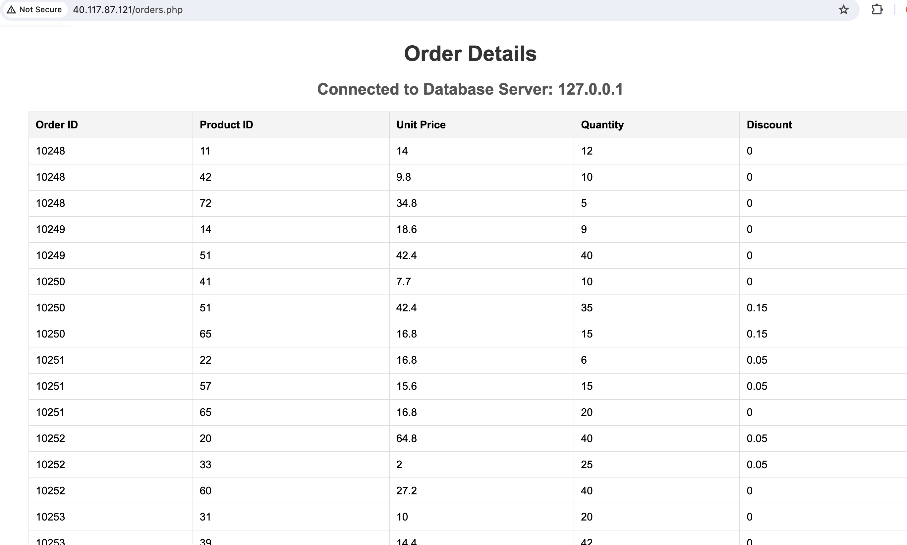

# Task 02 - Verify on-premises web application

## Description

In this task, you will configure the web application hosted on the simulated on-premises virtual machine that was provisioned by the ARM Template deployment.


## Success Criteria

* Web Application is loading correctly.


## Solution

<details markdown="block">
<summary>Expand this section to view the solution</summary>

1. In the **Azure Portal**, navigate to the **Resource Group** that you created for this lab, then select the **On-premises Workload VM** named similar to `terrafirm-onprem-workload-vm`.

    

2. On the **Virtual Machine** blade, locate and copy the **Public IP Address** for the VM.

    

3. Open a new browser window, then navigate to the following `http://` URL to access the simulated on-premises web application provisioned for this lab. Be sure to replace the `<ip-address>` placeholder with the **Public IP Address** for the VM.

    ```text
    http://<ip-address>
    ```

    > **Note**: If you get an error loading the web application, instead of a login page, then there was an error in provisioning. The easiest workaround is to delete the resource group and run the template deployment again.

4. When the web application loads, you may enter the following credentials to login.

    - **Username**: `Admin`
    - **Password**: `ipamadmin`

    

    > **Note**: The first time you login to the web application, it will prompt you to change the Admin password. A recommended password to change it to is `demo!pass123` so it's easily remembered for the lab.

At this point, things are ready for you to go through the lab.


</details>