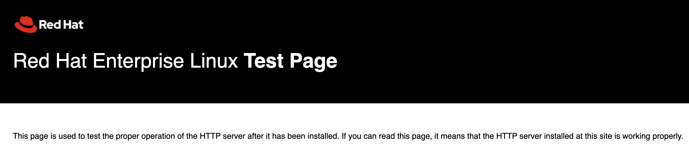

# Task 02 - Validate on-premises web application

## Description

In this task, you will validate the web application hosted on the simulated on-premises APP virtual machine that was provisioned by the ARM Template deployment.

## Success Criteria

* Web Application is operating correctly.

## Solution

<details markdown="block">
<summary>Expand this section to view the solution</summary>

1. In the **Azure Portal**, navigate to the **Resource Group** that you created for this lab, then select the **On-premises APP VM** named similar to `terrafirm-onprem-app-vm`.

    

1. On the **Virtual Machine** blade, locate and copy the **Public IP Address** for the VM.

    

1. Open a new browser window, then navigate to the following `http://` URL to access the simulated on-premises web application provisioned for this lab. Be sure to replace the `<ip-address>` placeholder with the **Public IP Address** for the VM.

    ```text
    http://<ip-address>
    ```

    > **Note**: You should get the Red Hat Enterprise Linux Test Page
    > 

1. When the web page loads, you may enter the following to the end of the URL.

    ```text
    http://<ip-address>/orders.php

    for example http://74.235.231.226/orders.php
    ```

    

At this point, things are ready for you to go through the lab.

</details>
