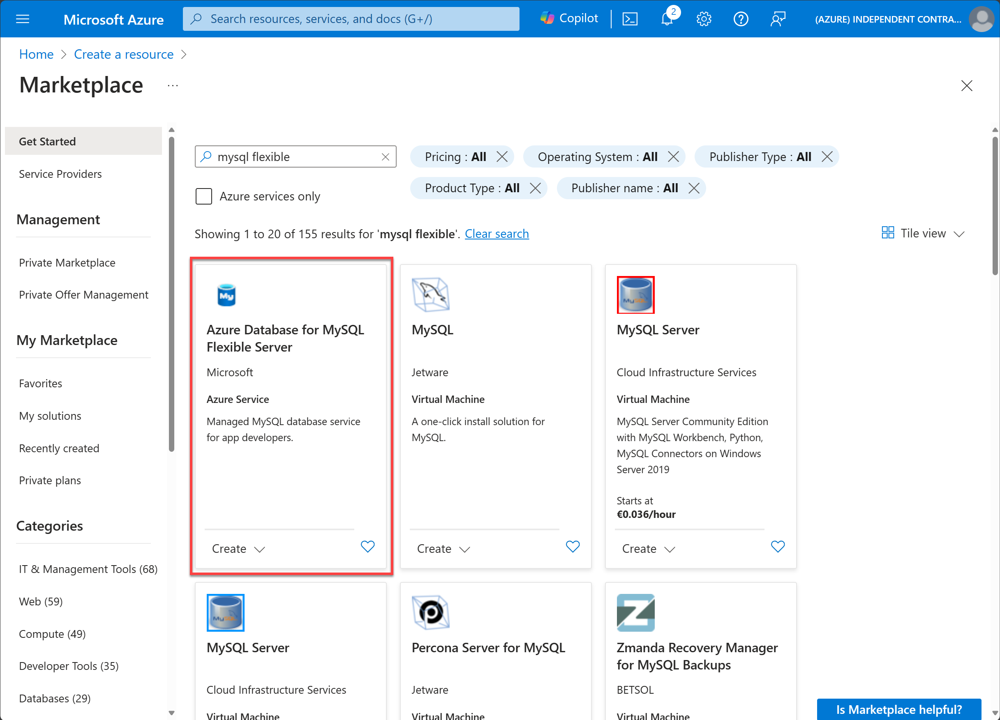
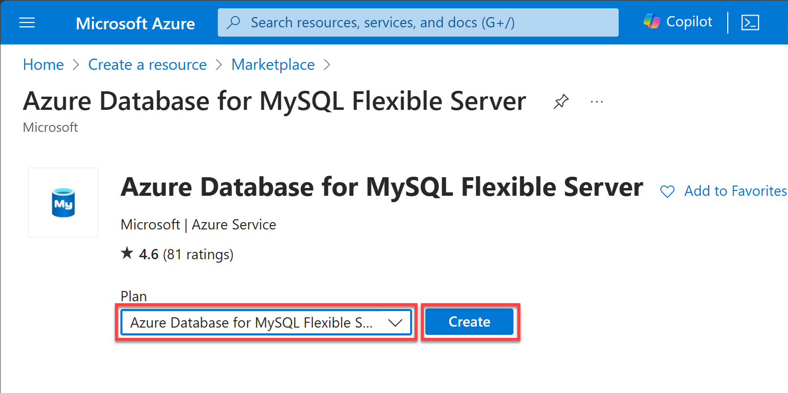
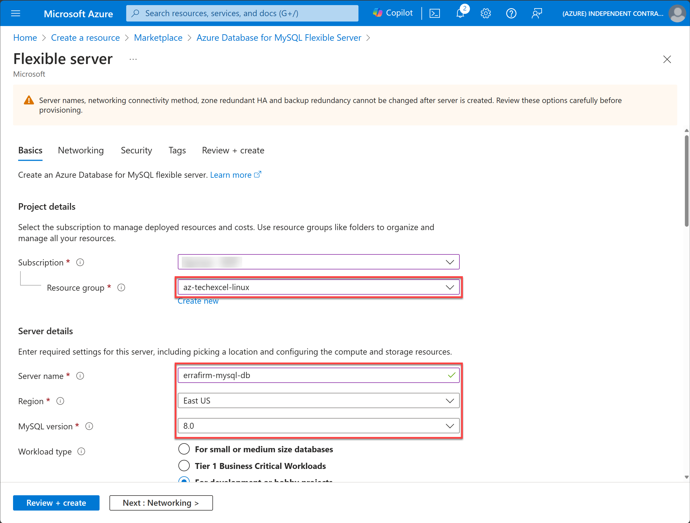
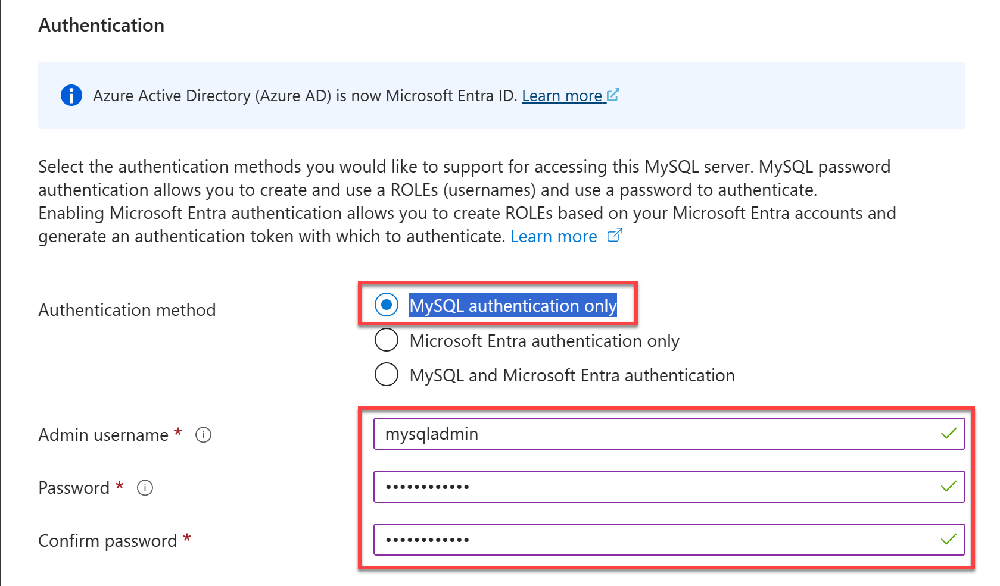
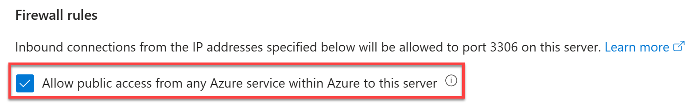
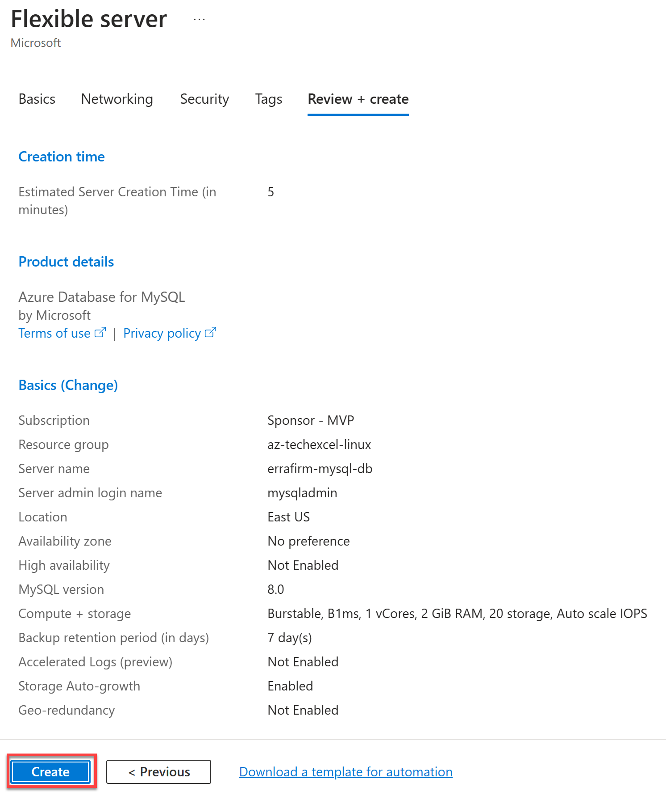
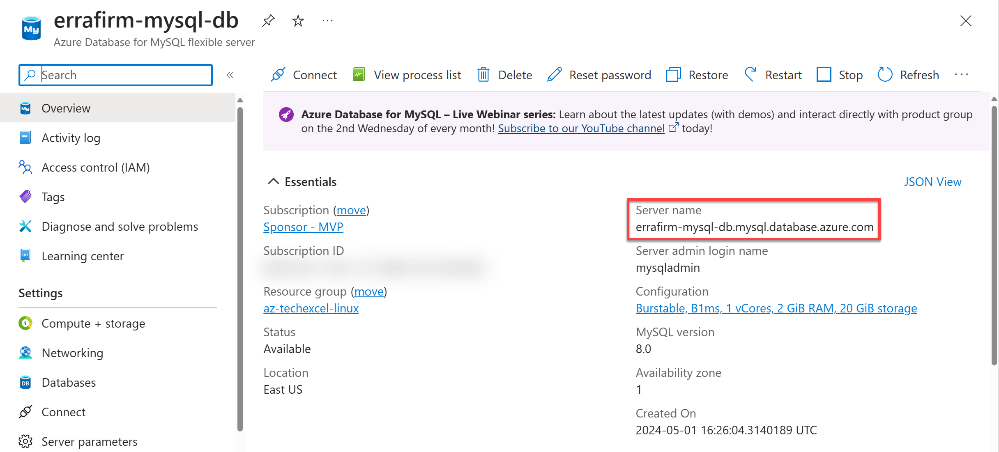
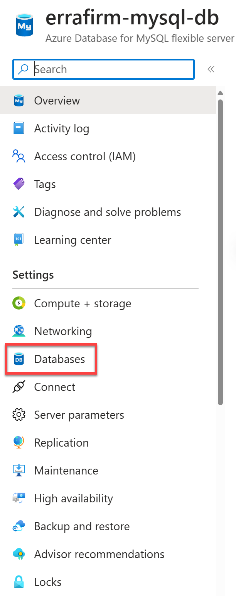

# Task 01 - Create Azure Database for MySQL

## Description

In this task, you will create a new MySQL database that will be the target for the database migration.

## Success Criteria

* Create a new MySQL database that will be the target for the database migration

## Solution

Expand this section to view the solution

1. Sign in to the [Azure Portal](https://portal.azure.com). Ensure that you're using a subscription associated with the same resources you created during the Lab setup.

2. On the **Home** page within the Azure Portal, towards the top, select **Create a resource**.

    

3. Within the **Search services and marketplace** field, type `mysql flexible`, press Enter, then select **Azure Database for MySQL Flexible Server** in the search results.

    

4. Select **Create**.

    

5. On the **Flexible server** pane, select the following values:

    - **Resource group**: Select the resource group that you created for this lab. Such as `terrafirm-rg`.
    - **Server name**: Enter a unique name, such as `terrafirm-mysql-db`.
    - **Region**: Select the Azure Region that was used to create the resource group.
    - **MySQL version**: `8.0`

    

6. Under **Authentication**, set the **Authentication method** to **MySQL authentication only**, set the **Admin username** and **Password** for the MySQL admin account.

    

    > **Note**: Be sure to save the **Admin username** and **Password**, so it can be used later. A recommendation for an easy to remember Username is `mysqladmin` and Password is `demo!pass123`.

7. Select **Next: Networking >**.

    

8. On the **Networking** tab, under **Firewall rules**, select the checkbox for **Allow public access from any Azure service within Azure to this server**.

    

9. Select **Review + create**.

    

10. Select **Create** to provision the service.

    

11. Once provisioning has completed navigate to the **Azure Database for MySQL** resource that was just created, copy and save the **Server name** for use later.

    

12. On the left menu pane, under **Settings** select **Databases**.

    

13. Select **+ Add** to create a new database.

    

14. On the **Create Database** pane, enter `phpipam` in the **Name** field, then select **Save**. This will create a new MySQL database that will be the target for the database migration.

    

