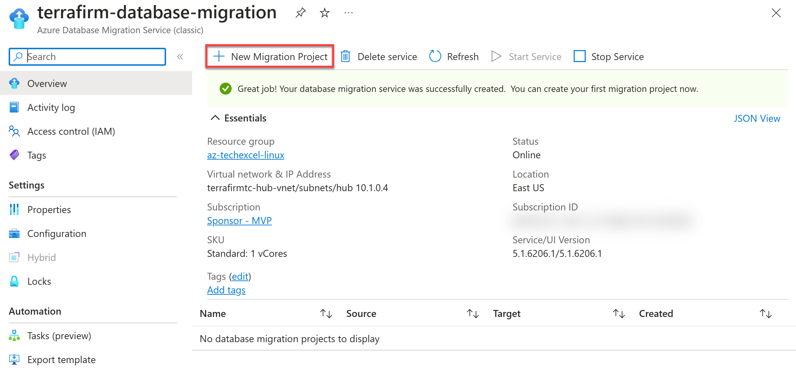
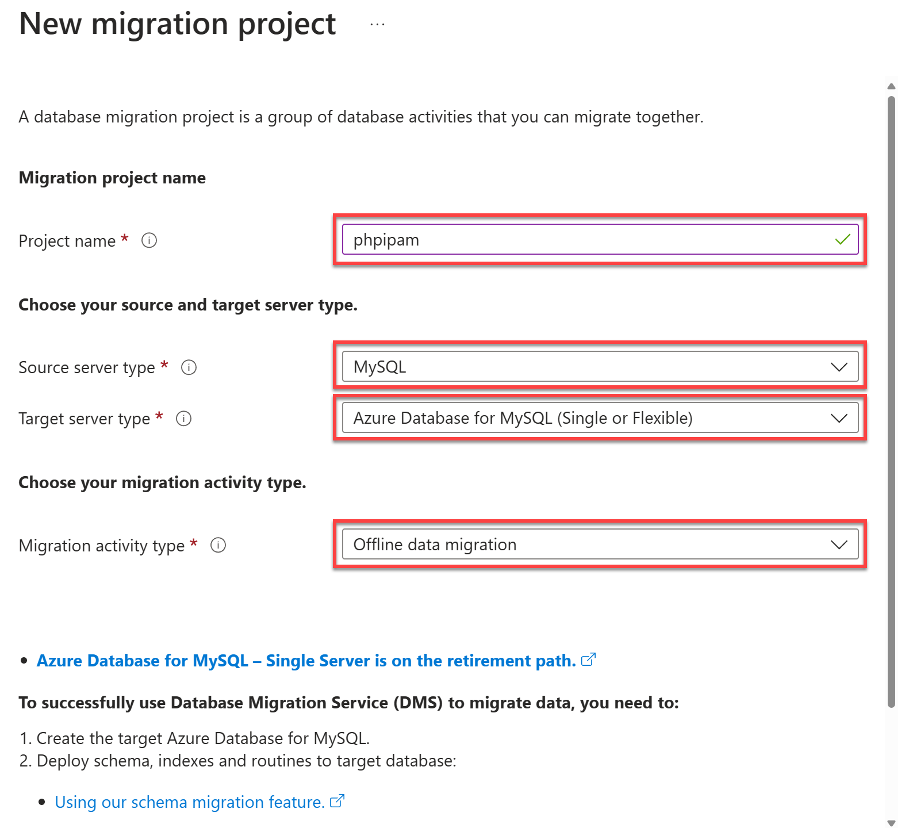
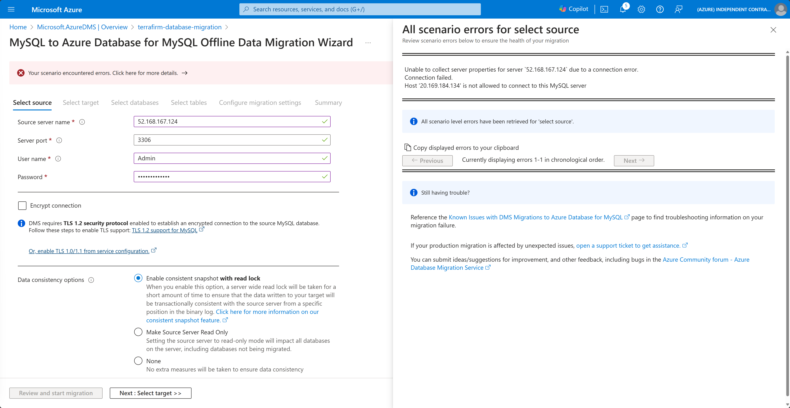
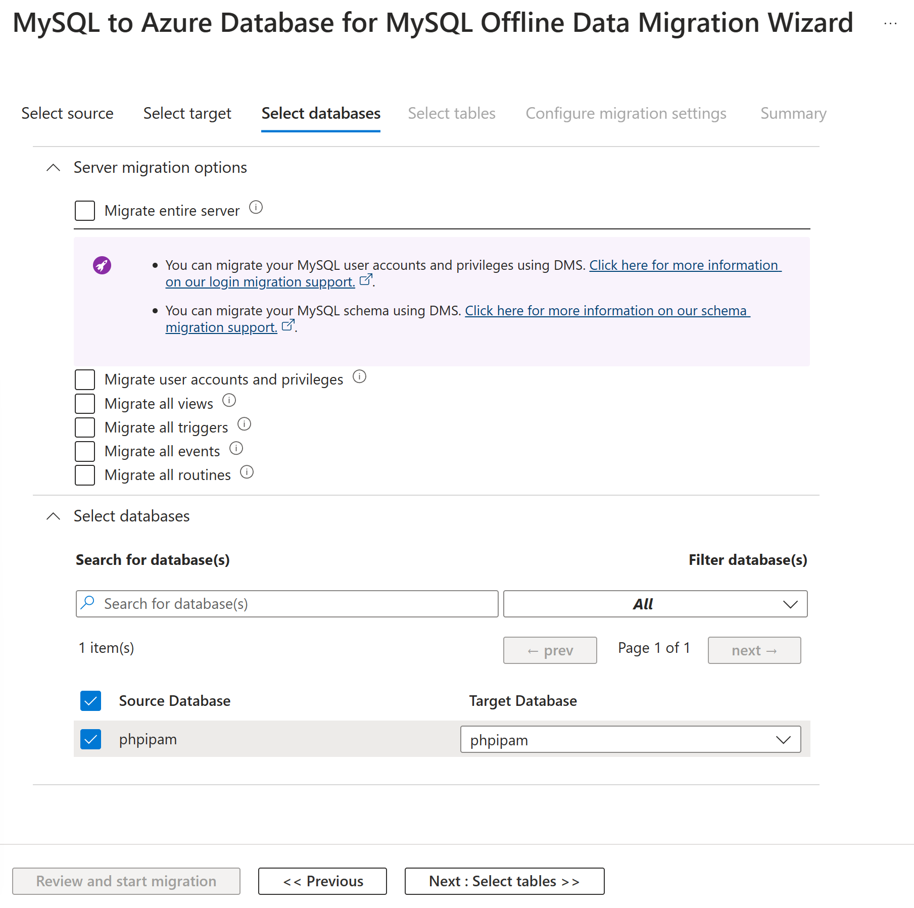
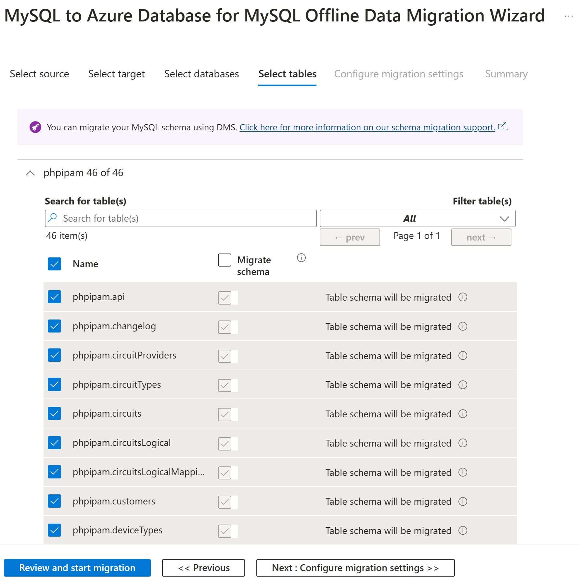
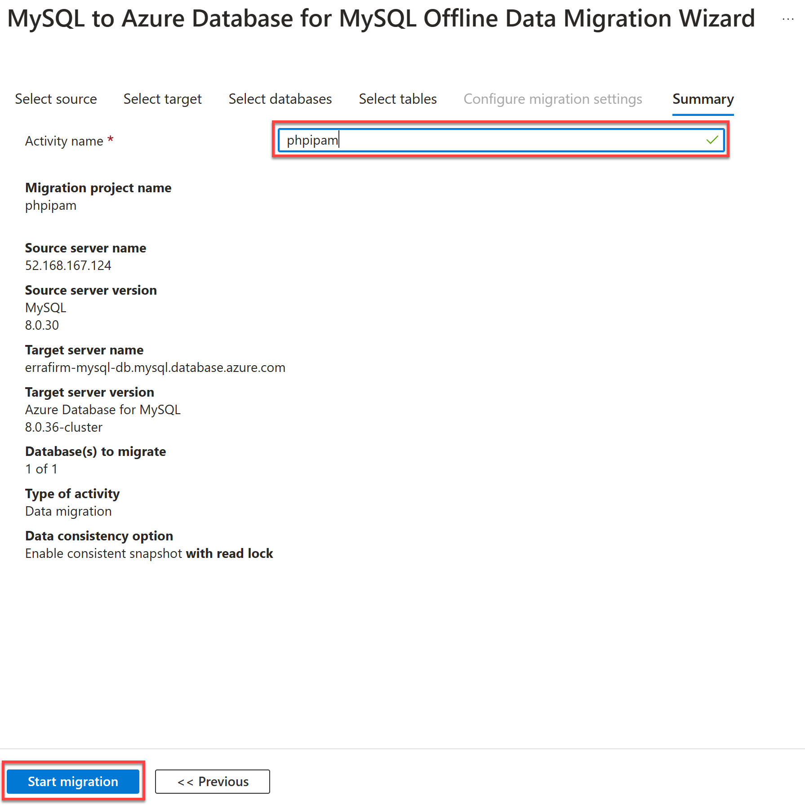

# Task 03 - Create Azure Database for MySQL

## Description

In this task, you will create .....

## Success Criteria

* aaaa.

## Solution

Expand this section to view the solution

1. In the Azure Portal, navigate to the newly created **Azure Database Migration Service** and select the **+ New Migration Project** button.

    

2. On the **New migration project** blade, select the following values:

    - **Project name**: `phpipam`
    - **Source server type**: `MySQL`
    - **Target server type**: `Azure Database for MySQL (Single or Flexible)`
    - **Migration activity type**: `Offline data migration`

    

3. Select **Create and run activity**.

    

4. On the **MySQL to Azure Database for MySQL Offline Data Migration Wizard** blade, enter the following values on the **Select source** tab, then select **Next: Select target >>**.

    - **Source server name**: Enter the **Public IP Address** of the on-premises workload server named similar to `terrafirm-onprem-workload-vm`.
    - **Server port**: `3306`
    - **User name**: `root`
    - **Password**: `demopass123`
    - **Encrypt connection**: Uncheck this box.

    

5. On the **Select target** tab, enter the following values to select the **Azure Database for MySQL** service that was previously provisioned.

    - **Location**: The Azure Region that's used for this lab.
    - **Resource group**: The Resource Group for this lab, named similar to `terrafirm-rg`.
    - **Azure Database for MySQL**: The Azure Database for MySQL service provisioned previously that is named similar to `terrafirm-mysql-db`.
    - **User name**: `mysqladmin`
    - **Password**: `demo!pass123`

    > **Note**: If a different **User name** and **Password** were configured when provisioning the **Azure Database for MySQL** service, then use those credentials instead.

    

   - **Potential Error**

    

    > **Note**: This error indicates incorrect MySQL user permissions. During the "Before the HOL" process, in Task 2, Step 4, were you able to successfully log in to the phpipam web application? If not, there might have been an error in the ARM Template deployment scripts. Check the deployment log of the Resource Group for indications of a failed deployment. If the deployment script did fail, you'll need to delete the resources or the entire resource group and then redo the "Before the HOL" deployment steps. Fixing a failed "Before the HOL" deployment isn't straightforward, so recreating it is often the simplest solution.

6. On the **Select database** tab, ensure the `phpipam` database is selected for both the **Source Database** and **Target Database**, then select **Next: Select tables >>**.

    

7. On the **Select tables** tab, expand the `phpipam` table, and make sure all tables are selected, then select **Review and start migration**.

    

8. On the **Summary** tab, enter `phpipam` into the **Activity name** field, then select **Start migration**.

    

9. A migration details pane will now display, showing the **Status** as **Pending** while the migration is running.

    

10. After a minute, select **Refresh** to check if the migration has been completed. Once complete, the **Status** will show as **Completed** and the **Migration details** will display the total number of tables that have been migrated.

    

