# Task 01 - Create Azure Database for PostgreSQL

## Description

In this task, you will create a new PostgreSQL database that will be the target for the database migration.

## Success Criteria

* Create a new database hosted in Azure Database for PostgreSQL - Flexible Server that will be the target for the database migration.

## Solution

Expand this section to view the solution

1. Sign in to the [Azure Portal](https://portal.azure.com). Ensure that you're using a subscription associated with the same resources you created during the Lab setup.

1. On the **Home** page within the Azure Portal, towards the top, select **Create a resource**.

    

1. Within the **Search services and marketplace** field, type `PostgreSQL flexible`, press Enter, then select **Azure Database for PostgreSQL Flexible Server** in the search results.

    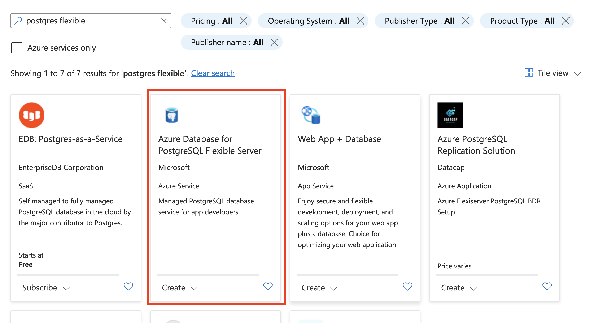

1. Select **Create**.

    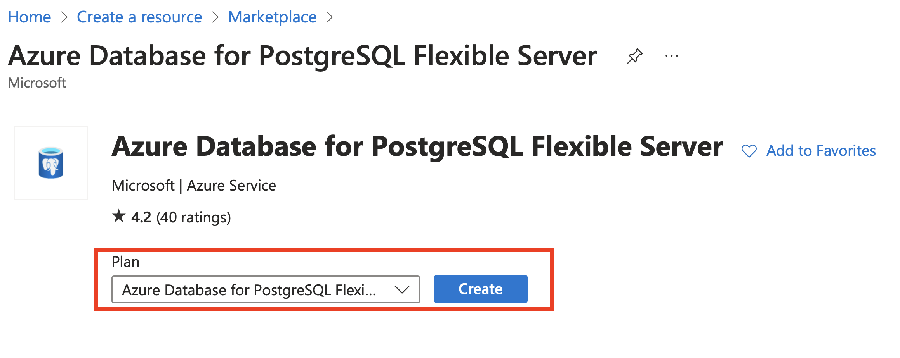

1. On the **Flexible Server** pane, select the following values:

    1. **Resource group**: Select the resource group that you created for this lab. Such as `terrafirm-rg`.
    1. **Server name**: Enter a unique name, such as `terrafirm-postgresql-db`.
    1. **Region**: Select the Azure Region that was used to create the resource group.
    1. **PostgreSQL version**: `16.0`
    1. **Workload Type**:Development

    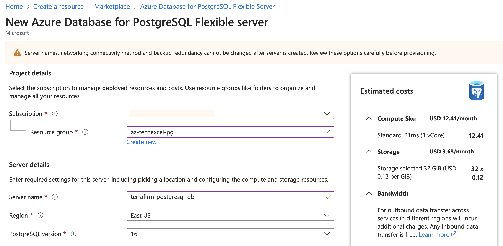

1. Under **Compute + storage** click **Configure server** and on the resultant pane choose
    1. General Purpose (2-96 vCores) - Balanced configuration for most common workloads**
    1. In **Compute Processor** Choose **Intel**

    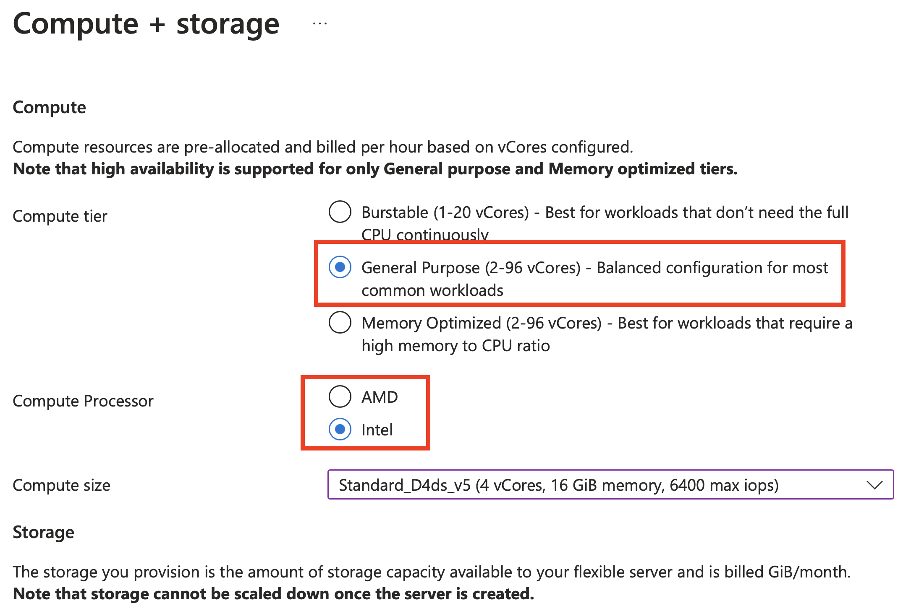

    1. In **Compute size** choose the lowest compute size to save costs for the lab exercises. Currently this is `Standard_D2ds_v5 (2 vCores, 8GiB memory, 3750 max iops)`

    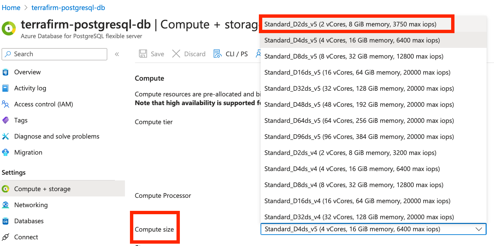

    1. In **High availability** Choose **Disabled (99.9% SLA)**
    1. Click **Save**

    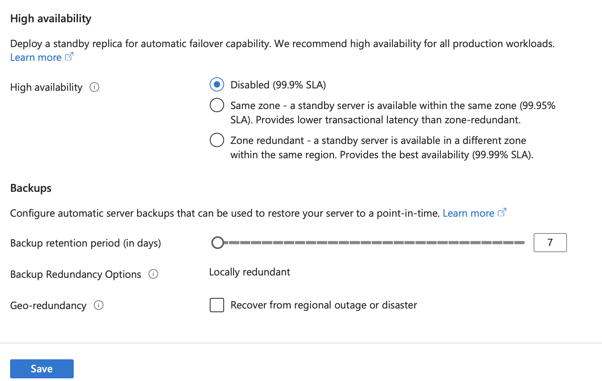

1. On the resultant page, under **Authentication**, set the **Authentication method** to **PostgreSQL authentication only**, set the **Admin username** and **Password** for the PostgreSQL admin account.

    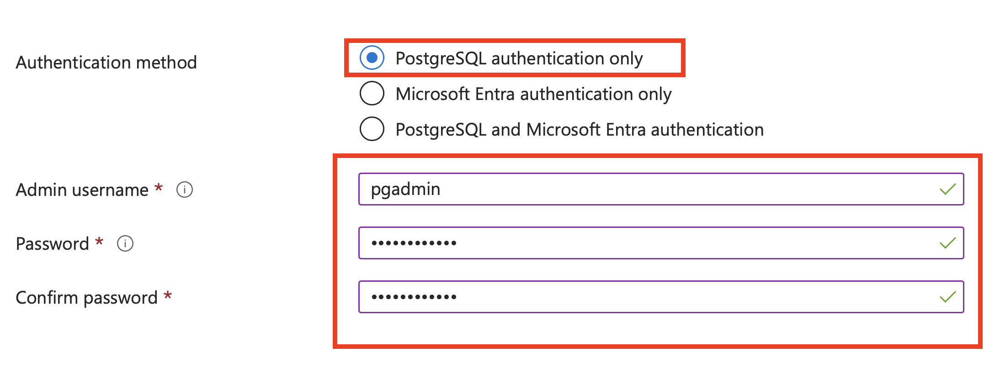

    > **Note**: Be sure to save the **Admin username** and **Password**, so it can be used later. A recommendation for an easy to remember Username is `pgadmin` and it is recommended you use a secure password.
    > **Important** For your password use at least 12 characters, combine uppercase and lowercase letters, numbers, and special characters. Avoid common words and personal information.

1. Select Next: Networking >>

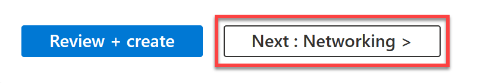

1. Go to **Firewall  rules** to configure access to allow the web application on the terrafirm-onprem-app-vm virtual machine to connect to the database.

1. Add a new Firewall rule with the following values

    1. **Firewall rule name**: webapp-vm
    1. **Start IP address:** Enter the Public IP Address for the terrafirm-onprem-app-vm virtual machine.
    1. **End IP address:** Enter the Public IP Address for the terrafirm-onprem-app-vm virtual machine.

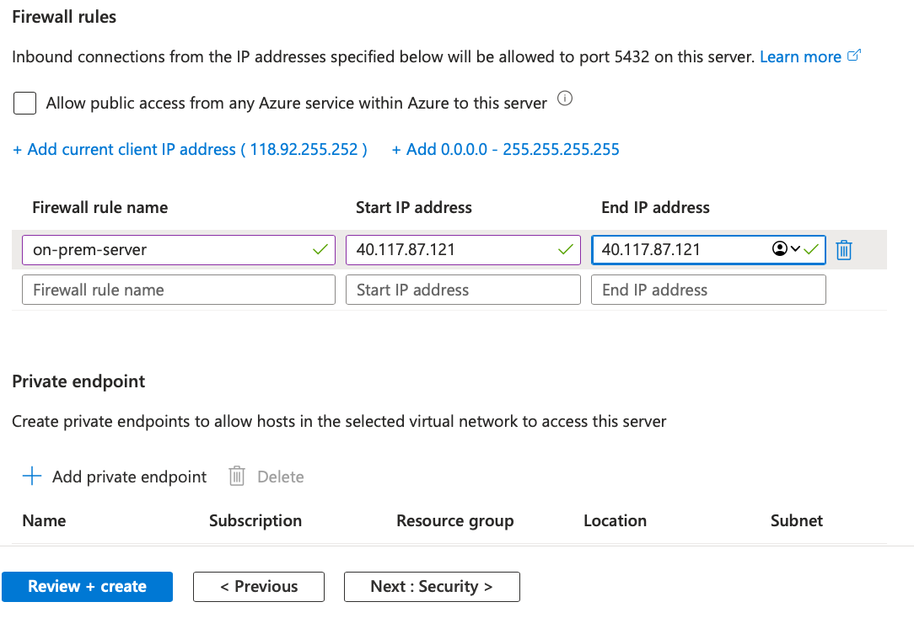

1. Select **Review + create**.

    

1. Select **Create** to provision the service.

    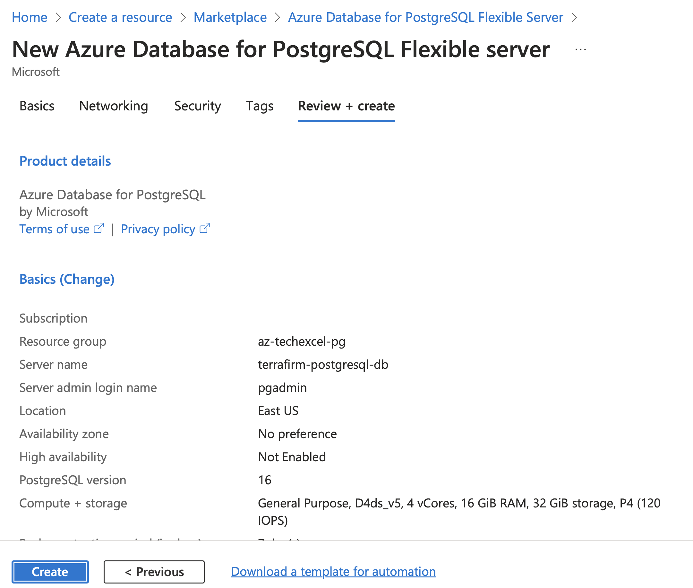

1. Once provisioning has completed navigate to the **Azure Database for PostgreSQL** resource that was just created, copy and save the **Server name** for use later.

    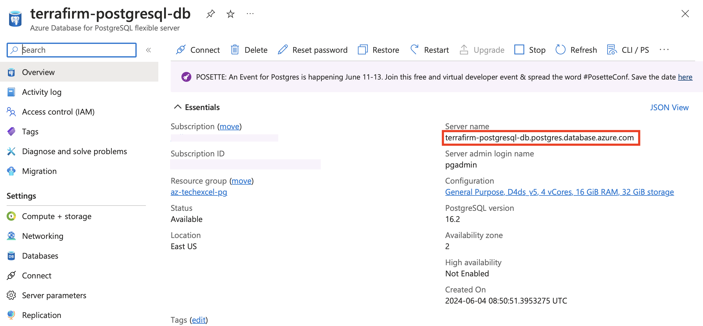

1. On the left menu pane, under **Settings** select **Databases**.

    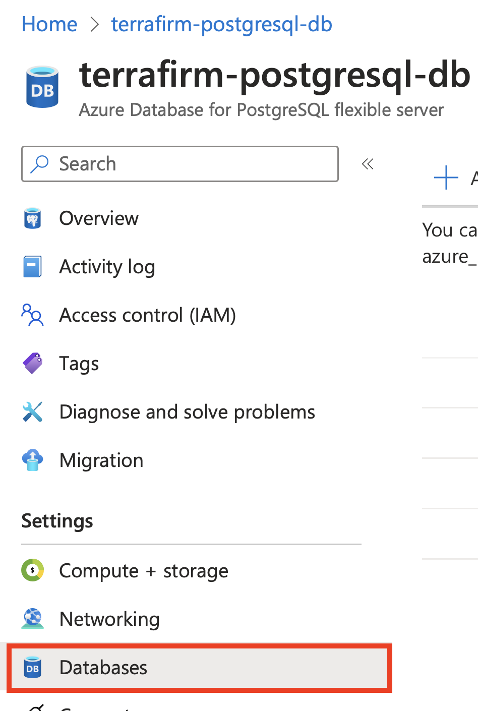

1. Select **+ Add** to create a new database.

    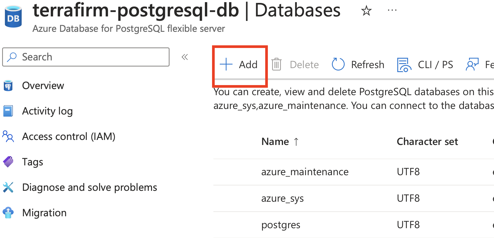

1. On the **Create Database** pane, enter `northwind` in the **Name** field, then select **Save**. This will create a new PostgreSQL database that will be the target for the database migration.

    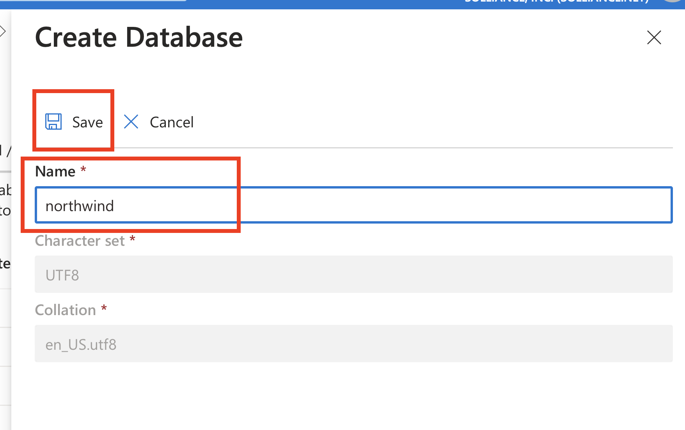

You are now ready to begin the migration task of this lab.

