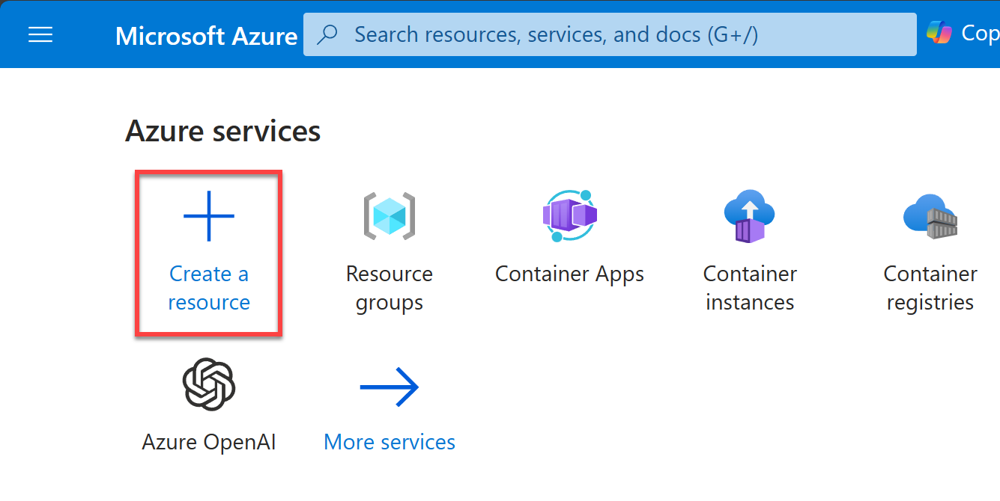
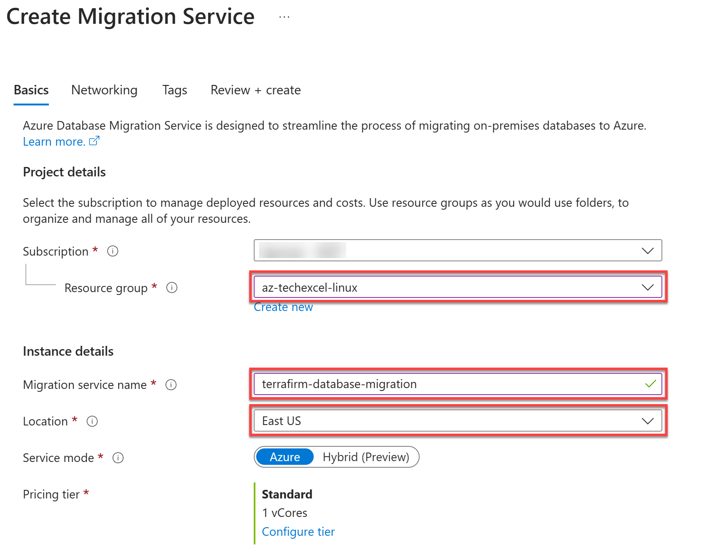
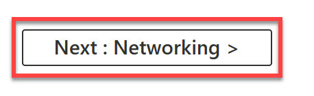
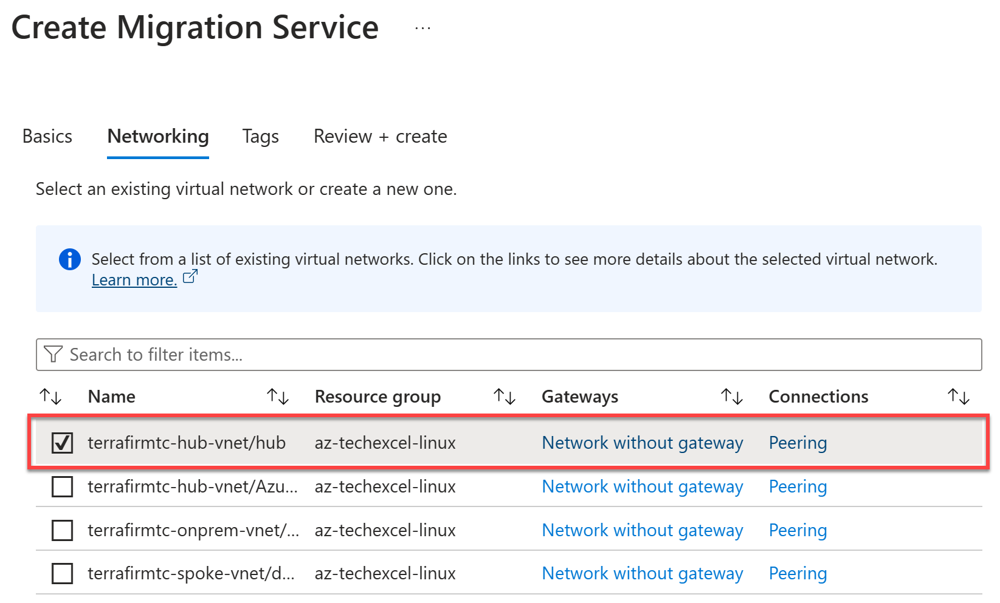
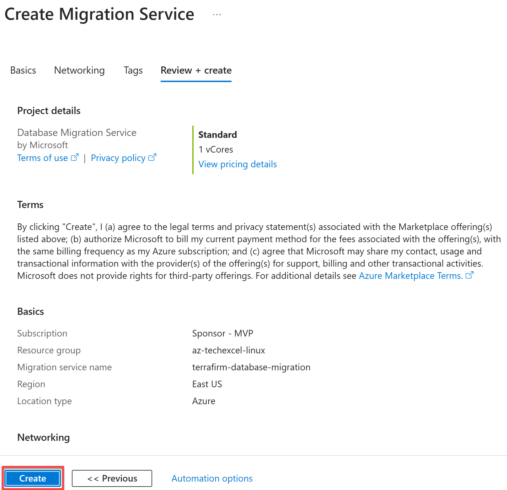

# Task 02 - Create Azure Database Migration Service

## Description

In this task, you will create .....

## Success Criteria

* aaaa.

## Solution

Expand this section to view the solution

1. On the **Home** page within the Azure Portal, towards the top, select **Create a resource**.

    

2. Within the **Search services and marketplace** field, type `azure database migration service`, press Enter, then select **Azure Database Migration Service** in the search results.

    

3. Select **Create**.

4. On the **Select migration scenario and Database Migration Service** pane, select the following values:

    - **Source server type**: `MySQL`
    - **Target server type**: `Azure Database for MySQL`

    

5. Select the **Select** button.

    

6. On the **Create Migration Service** pane, select the following values:

    - **Resource group**: Select the resource group that you created for this lab. Such as `terrafirm-rg`.
    - **Migration service name**: Enter a unique name, such as `terrafirm-database-migration`.
    - **Location**: Select the Azure Region that was used to create the resource group.

    

7. Select **Next: Networking >>**.

    

8. On the **Networking** tab, select the **terrafirm-hub-vnet/hub** VNet and Subnet.

    

9. Select **Review + create**.

    

10. Select **Create** to provision the service.

    

