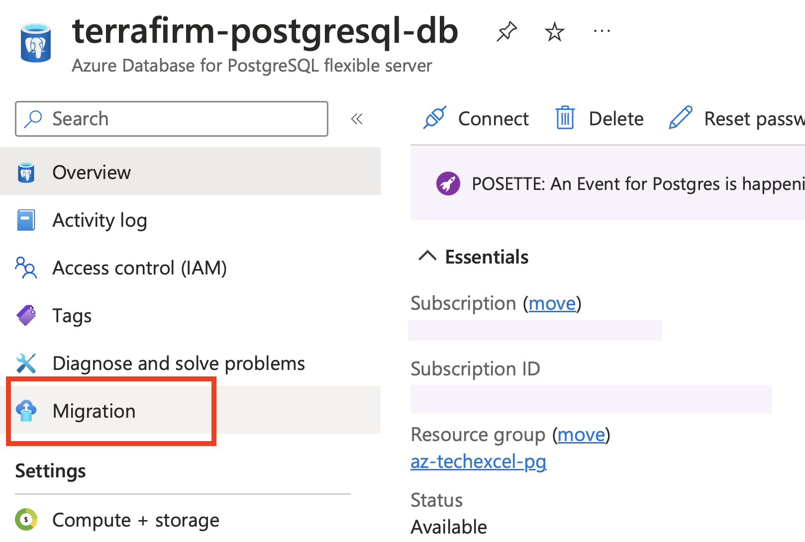
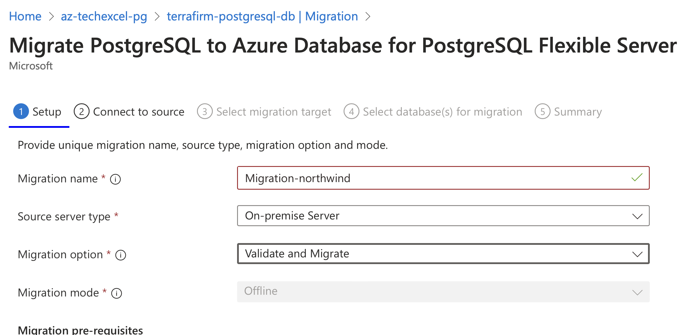
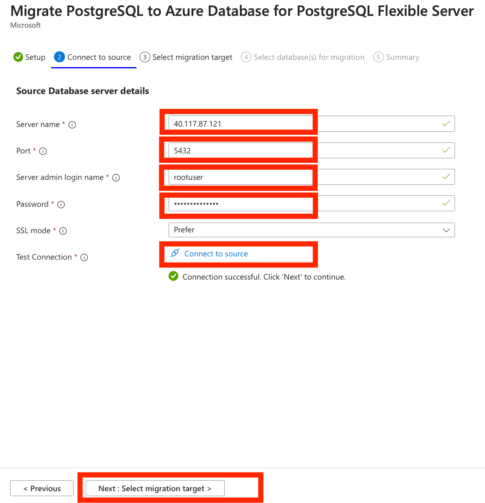
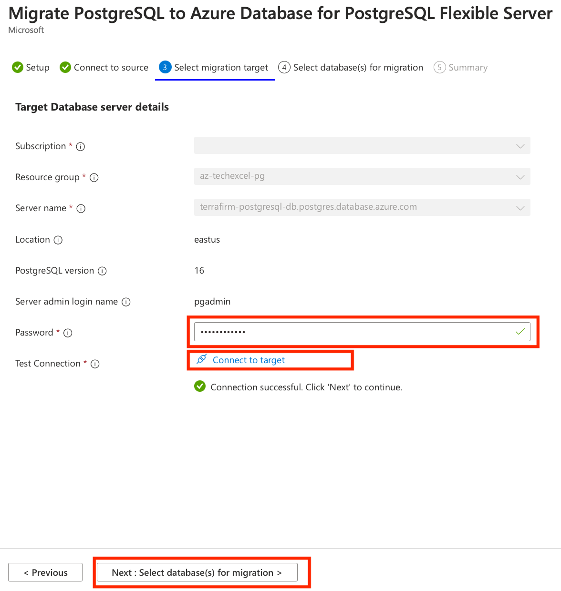
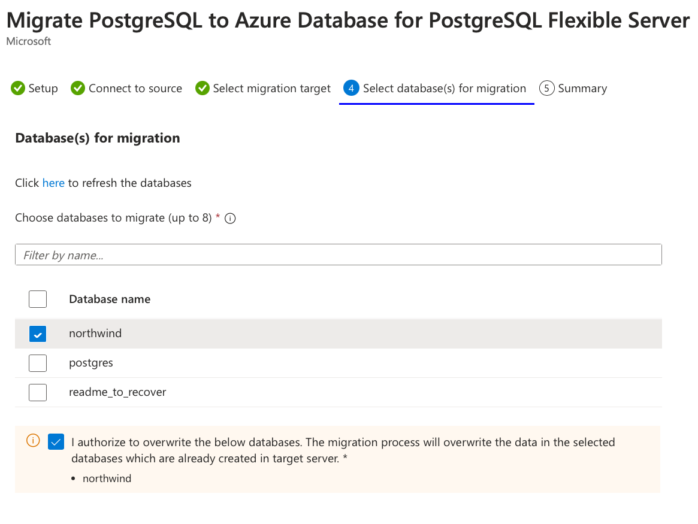
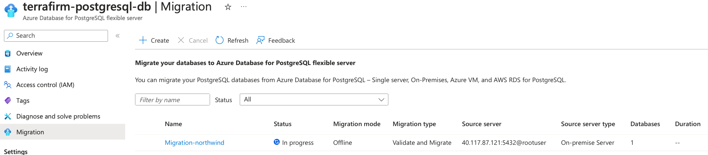
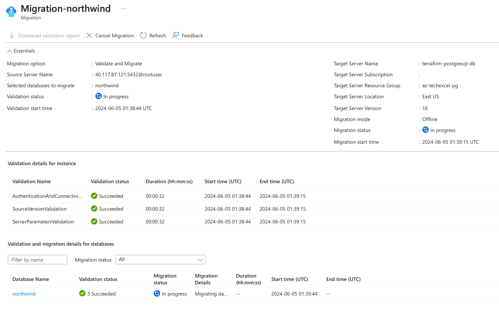

# Task 02 - Migrate your database to Azure Database for PostgreSQL flexible server

## Description

In this task, you will setup a migration project and configure the Source and Target connections. You will then execute and monitor a migration of your on-premises PostgreSQL database into Azure Database for PostgreSQL - flexible server.

## Success Criteria

* Your PostgreSQL that is hosted on your on-premises server is now migrated to Azure Database for PostgreSQL - flexible server.

## Solution

Expand this section to view the solution

## Create Database Migration Project in Azure Database for PostgreSQL Flexible Server

1. Select **Migration** from the menu on the left of the flexible server blade.

   

1. Click on the **+ Create** option at the top of the **Migration** blade.
   > **Note**: If the **+ Create** option is unavailable, select **Compute + storage** and change the compute tier to either **General Purpose** or **Memory Optimized** and try to create the Migration process again. 
   > After the Migration is successful, you can change the compute tier back to **Burstable**.
1. On the **Setup** tab, enter each field as follows:
    1. Migration name - `Migration-northwind`.
    1. Source server type - On-premise Server.
    1. Migration option - Validate and Migrate.
    1. Select **Next: Connect to source >**.

    

1. On the **Connect to source** tab, enter each field as follows:
    1. Server name - The IP address of your server that you built using the template.

    

    1. Port - The port your instance of PostgreSQL uses on your source server (default of **5432**).
    1. Server admin login name - the VM has been setup with an admin user called `rootuser` .
    1. Password - The password for the PostgreSQL admin user is `123rootpass456`
    1. SSL mode - Prefer.
    1. Click on the **Connect to source** option to validate the connectivity details provided.
    1. Click on the **Next: Select migration target** button to progress.

    

1. The connectivity details should be automatically completed for the target server we are migrating to.
    1. In the password field - enter the password for the **pgAdmin** login you created in the previous lab - the recommended password is `demo!pass123`
    1. Click on the **Connect to target** option to validate the connectivity details provided.

    

    1. Click on the **Next : Select database(s) for migration >** button to progress.
1. On the **Select database(s) for migration** tab, select the databases from the source server you want to migrate to the flexible server.

    

1. Click on the **Next : Summary >** button to progress and review the data provided.
1. On the **Summary** tab, review the information and then click the **Start Validation and Migration** button to start the migration to the flexible server.

    

1. On the **Migration** tab, you can monitor the migration progress by using the **Refresh** button in the top menu to view the progress through the validation and migration process.

    

    1. By clicking on the **Migration-northwind** activity, you can view detailed information about the migration activity’s progress.

    

Once the migration process is complete, we can perform post-migration tasks such as data validation in the new database and configuring high availability before pointing the application at the database and turning it on again.

