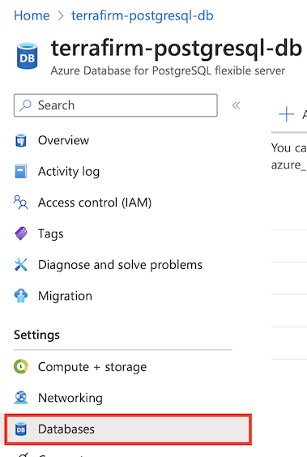
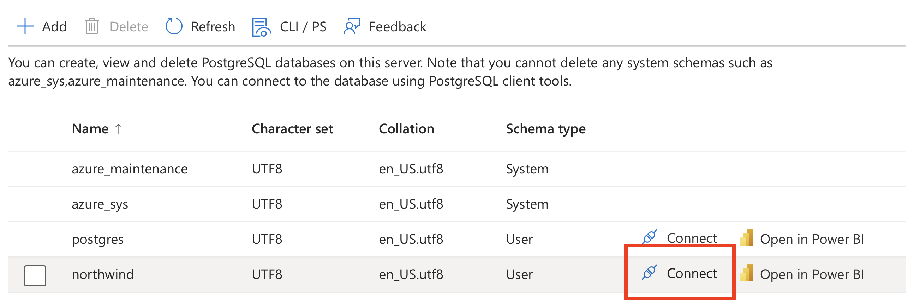
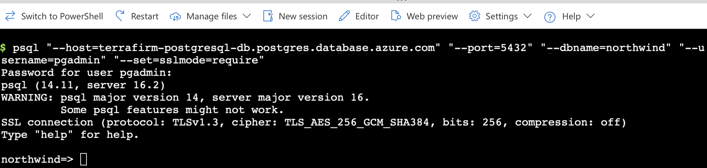
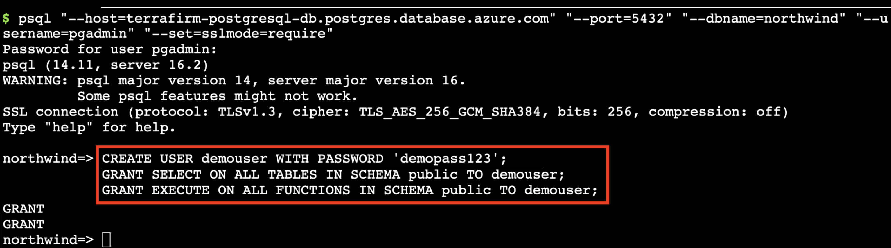

# Task 01 - Configure the migrated database for connectivity from the web application connection

## Description

In this task, you will connect to the migrated database in the Azure Database for PostgreSQL Flexible Server. You will configure the database to allow connectivity from the web application running on the VM to connect to the migrated PostgreSQL database.

## Success Criteria

* The database is configured for the web application to connect to it.

## Solution

<details markdown="block">
<summary>Expand this section to view the solution</summary>

1. In the **Azure Portal**, navigate to the **Resource Group** that you created for this lab.  

1. On the left menu pane, under **Settings** select **Databases**.

    

1. Choose **connect** on the `northwind` database which will bring up cloud shell
    

1. Enter the password for the **pgAdmin** login you created in the previous task - the suggested password is `demo!pass123`
    

1. You need to bring across the user and permissions for the web application to connect to the database. Which requires running a setup script in the migrated database. Run the script below:

    ``` sql
    CREATE USER demouser WITH PASSWORD 'demopass123';
    GRANT SELECT ON ALL TABLES IN SCHEMA public TO demouser;
    GRANT EXECUTE ON ALL FUNCTIONS IN SCHEMA public TO demouser;
    ```

    

At this point, things are ready for you to configure the web application to use the migrated database.

</details>
