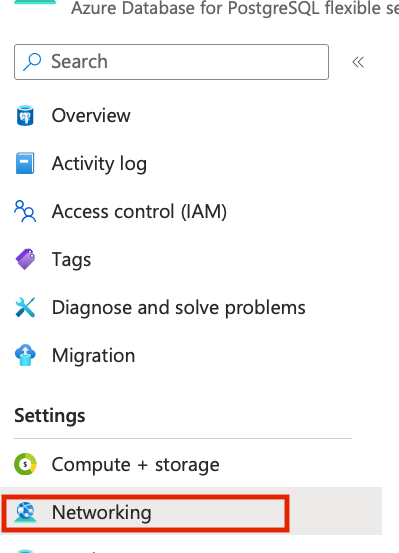
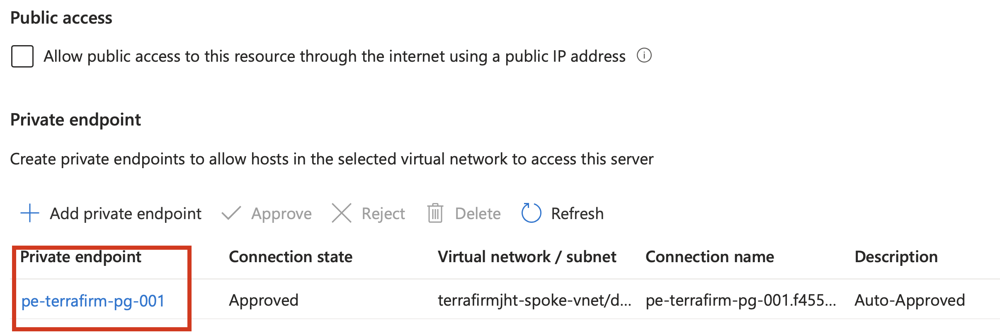
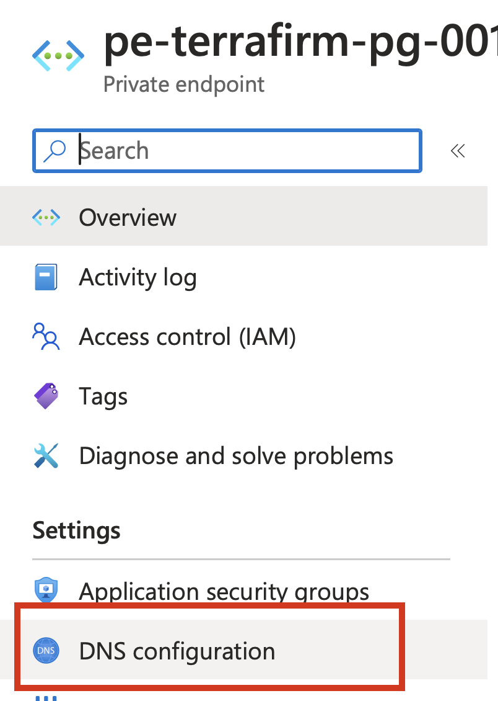
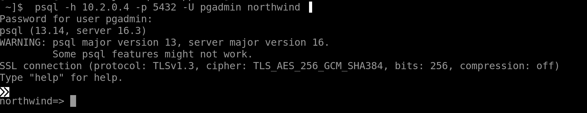

# Task 01 - Configure the migrated database for connectivity from the web application connection

## Description

In this task, you will connect to the migrated database in the Azure Database for PostgreSQL Flexible Server. You will configure the database to allow connectivity from the web application running on the VM to connect to the migrated PostgreSQL database.

## Success Criteria

* The database is configured for the web application to connect to it.

## Solution

<details markdown="block">
<summary>Expand this section to view the solution</summary>

1. In the **Azure Portal**, navigate to the **Resource Group** that you created for this lab, then select the Azure Database for PostgreSQL Flexible Server you just created.

1. Go to Networking in the left hand pane or search for `Networking` in search

    

1. Click on the Private Endpoin link

     

1. Click on DNS configuration or use search to find it

    

1. This will bring up the IP address that the private endpoint for PostgreSQL Flexible Server is using. You will use this IP address to connect via the bastion session.

    

1. In the **Azure Portal**, navigate to the **Resource Group** that you created for this lab, then select the **On-premises APP VM** named similar to `terrafirm-onprem-app-vm`.

    

1. On the **Virtual Machine** blade, either use the Search function in the left hand menu or click on Bastion. We will use a bastion host as the method to connect to our VMs as this is a more secure method.

    

    

1. Within the **Bastion** page, enter the following:
    1. **Authentication Type**    VM Password
    1. **Username**               demouser
    1. **VM Password**            <`the secure password you created when you created the VMs in Task01`>

     

    >**Note**: You may need to allow popups if they are blocked in your browser.

1. When connectioned to the VM via the Bastion host you will get a screen like this:

    

1. Once connected via Bastion, run the following command to install the git utility on the server by using the clipboard within the session:

    

1. Click the arrows which will expand the window

     

1. Within the clipboard windows enter the following (replacing **10.2.0.4** with the IP address of your private endpoint)

    ``` bash
    psql -h 10.2.0.4 -p 5432 -U pgadmin northwind
    
    ```

    Enter the password for the **PGAdmin** login you created in the previous task.

    

1. You need to bring across the user and permissions for the web application to connect to the database. Which requires running a setup script in the migrated database. Run the script below in the bastion clipboard:

    ``` sql
    CREATE USER demouser WITH PASSWORD 'demopass123';
    GRANT SELECT ON ALL TABLES IN SCHEMA public TO demouser;
    GRANT EXECUTE ON ALL FUNCTIONS IN SCHEMA public TO demouser;
    ```

    

1. You can quit out of the psql client session by typing the following:

    ``` bash
    \q
    ```

At this point, things are ready for you to configure the web application to use the migrated database.

</details>
