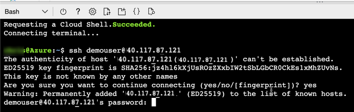
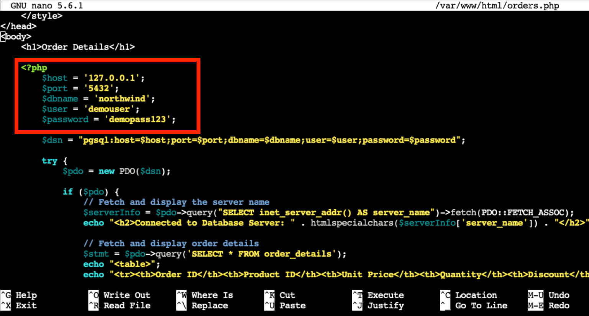
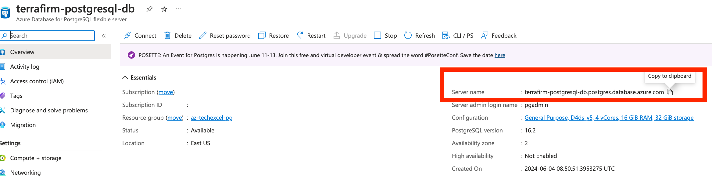
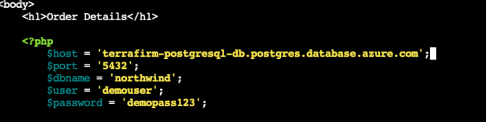
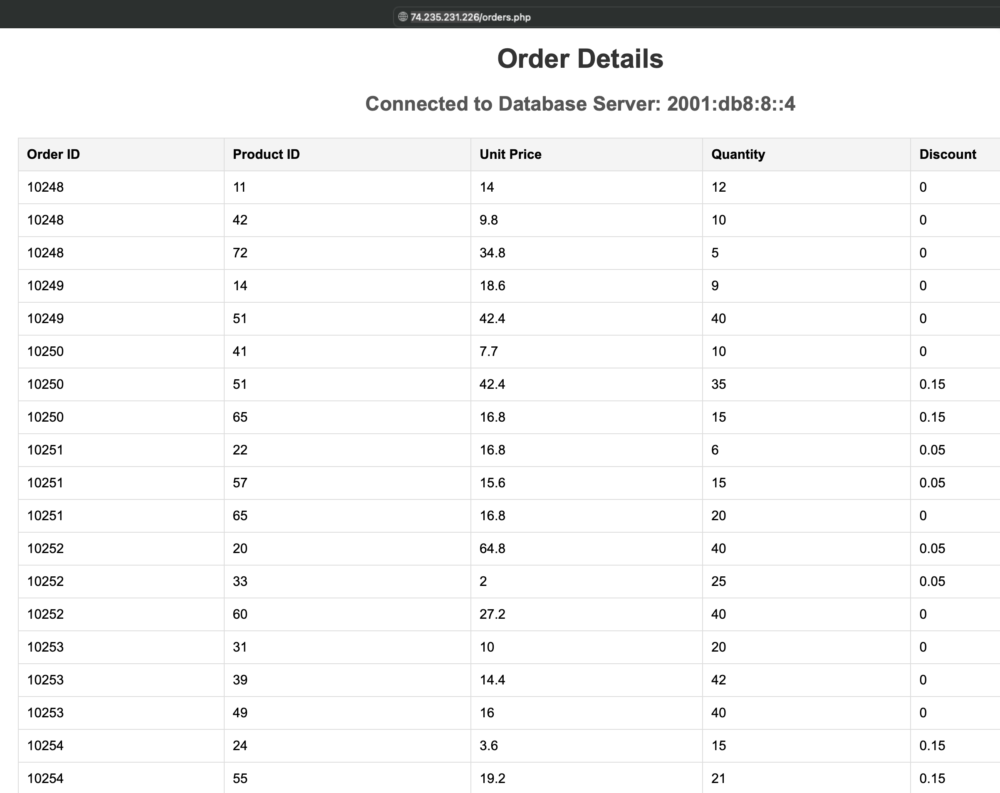
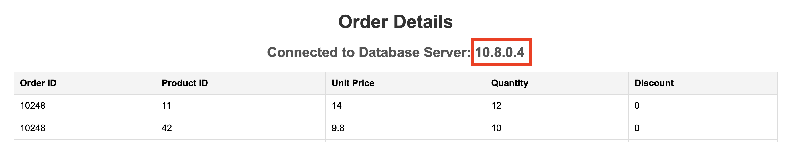

# Task 02 - Connect to the on-premises VM

## Description

In this task, you will connect to the on-premises VM that was created with the ARM template. You will configure the web application running on the VM to connect to the migrated PostgreSQL database, now running in Azure Database for PostgreSQL Flexible Server instance.

## Success Criteria

* The web application is now connected to the migrated database.

## Solution

<details markdown="block">
<summary>Expand this section to view the solution</summary>

1. In the **Azure Portal**, navigate to the **Resource Group** that you created for this lab, then select the **On-premises Workload VM** named similar to `terrafirm-onprem-workload-vm`.

    

1. On the **Virtual Machine** blade, locate and copy the **Public IP Address** for the VM.

    

At the top of the Azure Portal, select the **Cloud Shell** icon to open up the Azure Cloud Shell.


1. Within the **Cloud Shell**, enter the following `ssh` command to connect to the VM using SSH. Be sure to replace the `<ip-address>` placeholder with the **Public IP Address** that was just copied for the VM.

    ```bash
    ssh demouser@<ip-address>
    ```

1. When prompted, enter `y` and press Enter to access the certificate warning for this VM. Then continue by entering the **Password** for the VM.

    

    > **Note**: If you followed the previous suggestions for the VM username and password, then the password for the VM will be `demo!pass123`. Otherwise, enter the password you chose when provisioning the VM.

1. Once connected to the VM via SSH, execute the following command to open the `orders.php` file for the web application in a text editor. The application needs to be configured to connect to the **Azure Database for PostgreSQL Flexible Server** database that was previously migrated.

    ```bash
    sudo nano /var/www/html/orders.php
    ```

    

1. Within the `orders.php` file, set the following values for the **database connection details** section to configure it for Azure Database for PostgreSQL Flexible Server.

    

    1. **host**: Enter the **Server name** for the **Azure Database for PostgreSQL Flexible Server** instance that was previously copied.

    

    > **Note**: If you followed the suggestions in the lab, then the Azure Database for PostgreSQL Flexible Server administrator credentials should be the following:
    >
    > **User name**: `pgadmin`
    > **Password**: `demo!pass123`

1. To save the file, press `^X` (ctrl-X) to exit the editor, press `Y` to save the modified buffer, then press **Enter** to write the changes to the file.

1. Open a new browser tab, and navigate to the following URL to test that the web application is installed. Be sure to use `http://` since the web application is not currently configured for TLS/SSL.

    ```text
    http://<ip-address>/orders.php
    ```

1. The web application will look similar to the following screenshot.

    

1. Note that the database connection IP address has changed from 127.0.0.1 which was the on-premises PostgreSQL database to the newly migrated database hosted in Azure Database for PostgreSQL Flexible Server.

    

</details>
