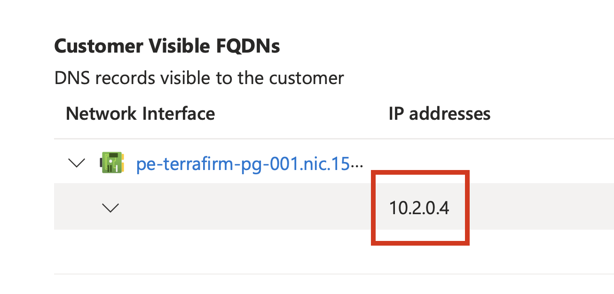
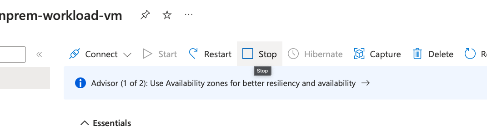

# Task 02 - Connect to the on-premises VM

## Description

In this task, you will connect to the on-premises APP VM that was created with the ARM template. You will configure the web application running on the VM to connect to the migrated PostgreSQL database, now running in Azure Database for PostgreSQL Flexible Server instance.

## Success Criteria

* The web application is now connected to the migrated database.

## Solution

<details markdown="block">
<summary>Expand this section to view the solution</summary>

1. In the **Azure Portal**, navigate to the **Resource Group** that you created for this lab, then select the **On-premises APP VM** named similar to `terrafirm-onprem-app-vm`.

    

1. On the **Virtual Machine** blade, either use the Search function in the left hand menu or click on Bastion. We will use a bastion host as the method to connect to our VMs as this is a more secure method.

    

    

1. Within the **Bastion** page, enter the following:
    1. **Authentication Type**    VM Password
    1. **Username**               demouser
    1. **VM Password**            <`the secure password you created when you created the VMs in Task01`>

     

    >**Note**: You may need to allow popups if they are blocked in your browser.

1. When connectioned to the VM via the Bastion host you will get a screen like this:

    

1. Once connected via Bastion, run the following command to install the git utility on the server by using the clipboard within the session:

    

1. Click the arrows which will expand the window

     

1. Once connected to the VM via the Bastion host, execute the following command to open the `orders.php` file for the web application in a text editor. The application needs to be configured to connect to the **Azure Database for PostgreSQL Flexible Server** database that was previously migrated.

    ```bash
    sudo nano /var/www/html/orders.php
    ```

    

1. Within the `orders.php` file, set the following values for the **database connection details** section to configure it for the Private Endpoint for your Azure Database for PostgreSQL Flexible Server.

    

    1. **host**: Enter the **IPAddress** for the **Azure Database for PostgreSQL Flexible Server** instance that was previously copied.

    

1. To save the file, press `^X` (ctrl-X) to exit the editor, press `Y` to save the modified buffer, then press **Enter** to write the changes to the file.

1. Open a new browser tab, and navigate to the following URL to test that the web application is installed. Be sure to use `http://` since the web application is not currently configured for TLS/SSL.

    ```text
    http://<ip-address>/orders.php
    ```

1. The web application will look similar to the following screenshot.

    

1. Note that the database connection IP address has changed from the IP address which was the on-premises PostgreSQL database (typically 10.0.0.4) to the newly migrated database hosted in Azure Database for PostgreSQL Flexible Server.

    >Note: The address might be in IPv6 notation.

    

You are now in a position to stop the On-premises server that was hosting the database.

1. In the **Azure Portal**, navigate to the **Resource Group** that you created for this lab, then select the **On-premises Workload VM** named similar to `terrafirm-onprem-workload-vm`.

    

1. Click stop



1. Click Yes to pop-up requesting that you want to stop the VM.

Congratulations you have migrated the database to Azure and configured the on-premises web application to use this migrated database. You will now Azure Arc-enable the on-premises VM that hosts the web application in the next lab.

</details>
